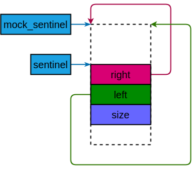

# UIT

## Introduction

**UIT** is a Unified Intrusive Linked List library. This library brings together 4 different linked lists based on a unified abstraction, the core trick is **mock_head**. In addition, some balanced trees have been implemented, what makes it different is that they're simplified with **mock_sentinel**, which is similar to the **mock_head**.

| types          | number of head  node pointers | number of data node pointers | order        | comments                                                     |
| -------------- | ----------------------------- | ---------------------------- | ------------ | ------------------------------------------------------------ |
| `uit::islist`  | single                        | single                       | LIFO         | Singly Linked List.                                          |
| `uit::isdlist` | single                        | double                       | LIFO         | It's equivalent to the hlist in linux, and mainly used to implement hash tables. |
| `uit::idslist` | double                        | single                       | LIFO or FIFO | It's mainly used to implement queues, node storage is more efficient than doubly linked lists. |
| `uit::idlist`  | double                        | double                       | LIFO or FIFO | Doubly Linked List.                                          |

The trick named **mock_head** brings the following pros and cons.

### Pros

- Simple and easy-to-understand code
- Fewer branches and better performance, e.g. there's no branch in the `uit::idslist::push_back` method
- Secondary pointers are no longer required, even the hlist (`uit::isdlist`) is no exception
- Truly zero overhead
- No macros

### Cons

- There are some undefined behaviors in the implementation of the **mock_head**. The [main branch](https://github.com/TypeCombinator/uit) uses type composition and `container_of` to implement the **mock_head**, which is completely **UB**, some test items cannot pass under high optimization level. The [v2 branch](https://github.com/TypeCombinator/uit/tree/v2) uses type inheritance and `static_cast` to implement the **mock_head**, unfortunately, this implementation still has some **UB**s, such as the **mock_head** implementation of `idslist`, where the head and **mock_head** have no inheritance relationship with each other, and violate strict aliasing.

## Notice

This project is used for experimental exploration, I will not bear any consequences caused by the practical application of this project.

It must be said that the [v2 branch](https://github.com/TypeCombinator/uit/tree/v2) is a better implementation under the current C++ standard definition, as it can **currently** (not guaranteed in the future) work on Clang and MSVC with high-level optimizations (such as O3), but for GCC, you must add an extra option`-fno-strict-aliasing`.

The [main branch](https://github.com/TypeCombinator/uit) is mainly used to help understand, due to `container_of` being UB and having many unresolved conflicts with the C++ standard, which does not conform to the future development direction of C++, I am pessimistic about the possibility of `container_of` becoming a standard definition, despite the significant demands in many scenarios.

**Please don't take a free ride on this project** without giving me any feedback (issue, star, fork or others), otherwise you may miss out on some better ideas. There's a **closed source version** in my local repository, it still uses **mock_head**, but **works well on the Big Three (GCC, Clang and MSVC) without any extra options**, after this project receives enough feedback or attention, I will open-source the version.

**Please comply with the license of this project**, as the BSD 3-Clause is really a very permissive license, **thank you very much**!

## mock_head

For simplicity, I will use a singly linked list as an example in C language. Firstly, we define a singly linked list node type `struct node`, and implement the `push_front`, the code is as follows:

```c
#include <stddef.h>

struct node {
    int sn;
    struct node *next;
};

static struct node *head = NULL;

void push_front(struct node *n) {
    n->next = head;
    head = n;
}
```

Traditionally, when we want to remove a node from a singly linked list, we need the help of a secondary pointer.

```c
struct node *remove_with_secondary_pointer(struct node *n) {
    struct node **prev = &head;
    for (struct node *cur = *prev; cur != NULL;) {
        if (cur == n) {
            *prev = cur->next;
            return cur;
        }
        prev = &cur->next;
        cur = *prev;
    }
    return NULL;
}
```

Why do we need a secondary pointer? The core reason is that the type of the head node and data node are different, and the secondary pointer unifies them. If we define the head as `static struct node head = {0, NULL};`, the secondary pointer will no longer be needed, but there is a problem of memory waste, the member `int sn;` is redundant in the example, we only need the member `struct node *next;`.

The solution is to use head node to simulate data node through the  `container_of`, the code is as follows:

```c
#define container_of(_field_, _type_, _member_)                                                    \
    ((_type_ *) ((size_t) (_field_) -offsetof(_type_, _member_)))

#define MOCK_HEAD(_field_, _type_, _member_) container_of(_field_, _type_, _member_)

struct node *remove_with_mock_head(struct node *n) {
    struct node *prev = MOCK_HEAD(&head, struct node, next);
    for (struct node *cur = prev->next; cur != NULL;) {
        if (cur == n) {
            prev->next = cur->next;
            return cur;
        }
        prev = cur;
        cur = prev->next;
    }
    return NULL;
}
```

As you can see, **mock_head** is just a alias of the `contianer_of`, it unifies head node and data node, just like secondary pointer. It should be noted that when accessing head node members, all members except for `struct node *next;` are undefined in the example.

Of course, this is just an example. The implementation of container_of is slightly different in C++, please see the [header](include/uit/intrusive.hpp) in this library.

### slist

For an empty slist: `head.right = nullptr;`.


### sdlist

For an empty sdlist: `head.right = nullptr;`.


### dslist


### dlist


## mock_sentinel



## Example

### For the main branch

```c++
#include <iostream>
#include <uit/islist.hpp>

class apple {
   public:
    apple(uint64_t weight, int sn)
        : weight(weight)
        , sn(sn) {
    }

    uint64_t weight;
    uit::isnode<apple> node;
    int sn;
};

int main(int argc, char *argv[]) {
    uit::islist<&apple::node> list{};

    apple a0{500, 0};
    apple a1{501, 1};
    apple a2{502, 2};
    apple a3{503, 3};

    list.push_front(&a3);
    list.push_front(&a2);
    list.push_front(&a1);
    list.push_front(&a0);

    for (const auto &i: list) {
        std::cout << "sn: " << i.sn << ", weight: " << i.weight << std::endl;
    }
    return 0;
}
```

### For the v2 branch

```c++
#include <iostream>
#include <uit/islist.hpp>

class apple : public uit::isnode<apple, "0"> {
   public:
    apple(uint64_t weight, int sn)
        : weight(weight)
        , sn(sn) {
    }

    uint64_t weight;
    int sn;
};

int main(int argc, char *argv[]) {
    uit::islist<apple, "0"> list{};

    apple a0{500, 0};
    apple a1{501, 1};
    apple a2{502, 2};
    apple a3{503, 3};

    list.push_front(&a3);
    list.push_front(&a2);
    list.push_front(&a1);
    list.push_front(&a0);

    for (const auto &i: list) {
        std::cout << "sn: " << i.sn << ", weight: " << i.weight << std::endl;
    }
    return 0;
}
```

### More

Please refer to the **examples** and **tests** folder.

## TODO

- Need more tests.

## Acknowledgements

[**ykiko**](https://github.com/16bit-ykiko) helped me answer the key questions I encountered in this project, and thank you all for your attention to this project.

